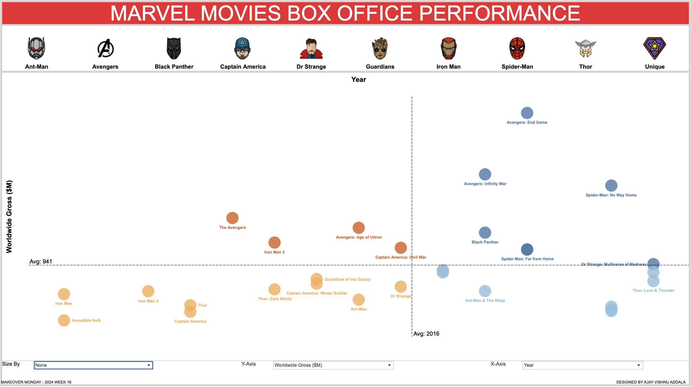

# Marvel Movies Box Office Performance Visualization

This repository contains a Tableau visualization of Marvel movies' box office performance. The visualization was created as part of the Makeover Monday challenge for week 16.

## About the Visualization

The visualization depicts various metrics related to the box office performance of Marvel movies. The metrics visualized include:

- 1st vs 2nd Weekend Drop Off (%)
- Audience Score (%)
- Audience vs Critics Deviance (%)
- Budget ($M)
- Budget Opening Weekend (%)
- Budget Recovered (%)
- Critics Score (%)
- Domestic Gross ($M)
- Gross from Domestic (%)
- Gross from International (%)
- Gross from Opening Weekend (%)
- International Gross ($M)
- Opening Weekend ($M)
- Second Weekend ($M)
- Worldwide Gross ($M)
- Year

The visualization is highly dynamic and interactive. Users can:

- Select axes for x and y dimensions.
- Choose the size of the bubbles.
- Hover over bubbles to view movie details.
- Hover over icons to view movies under specific categories.
- Select a category to filter the movie list.
- Each quadrant is color-coded to indicate the bucket the movie falls under.

## Repository Contents

- Tableau workbook file containing the visualization.
- Dataset used for creating the visualization.
- Snapshot of the visualization.

## How to Access the Visualization

You can view the visualization on Tableau Public by following this link: [Marvel Movies Box Office Performance Visualization](https://public.tableau.com/views/MarvelMoviesBoxOfficePerformanceMOM2024Week16/MARVEL?:language=en-US&:sid=&:display_count=n&:origin=viz_share_link).

Feel free to explore the visualization and interact with the data!

